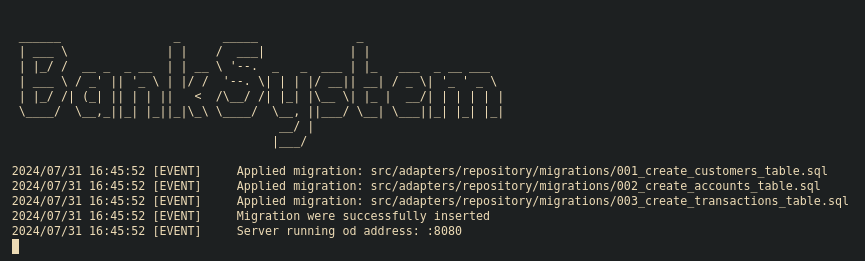
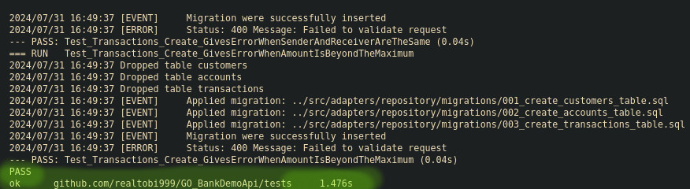

# Demo Bank API Project

## Table of Contents

- **[Summary](#summary)**
- **[How to Build?](#how-to-build)**
  - **[What About Tests?](#what-about-tests)**
- **[Architecture](#architecture)**
  - **[Tree Overview](#tree-overview)**
  - **[Core Business Logic - src/core](#core-business-logic---srccore)**
  - **[Ports - src/core/ports](#ports---srccoreports)**
  - **[Adapters - src/adapters](#adapters---srcadapters)**
  - **[Dependency Injection](#dependency-injection)**
  - **[Testing](#testing)**
  - **[Flexibility and Maintainability](#flexibility-and-maintainability)**
- **[Notes](#notes)**
- **[Api Endpoints](#api-endpoints)**
  - **[Success Response](#success-response)**
  - **[Error Response](#error-response)**
  - **[Authentication](#authentication)**
  - **[Customer Endpoints](#customer-endpoints)**
    - **[GET /api/customer](#get-apicustomer)**
    - **[GET /api/customer/{customer_id}](#get-apicustomercustomer_id)**
    - **[POST /api/customer](#post-apicustomer)**
    - **[PUT /api/customer/{customer_id}](#put-apicustomercustomer_id)**
    - **[DELETE /api/customer/{customer_id}](#delete-apicustomercustomer_id)**
  - **[Account Endpoints](#account-endpoints)**
    - **[GET /api/account](#get-apiaccount)**
    - **[GET /api/account/{account_id}](#get-apiaccountaccount_id)**
    - **[POST /api/{customer_id}/account](#post-apicustomer_idaccount)**
    - **[PUT /api/{customer_id}/account/{account_id}](#put-apicustomer_idaccountaccount_id)**
    - **[DELETE /api/{customer_id}/account/{account_id}](#delete-apicustomer_idaccountaccount_id)**
  - **[Transaction Endpoints](#transaction-endpoints)**
    - **[GET /api/transaction](#get-apitransaction)**
    - **[GET /api/transaction/{transaction_id}](#get-apitransactiontransaction_id)**
    - **[POST /api/{customer_id}/account/{account_id}/transaction`](#post-apicustomer_idaccountaccount_idtransaction)**

## Summary

- This is a **REST DEMO API** for a banking system featuring **CRUD** operations for customers and accounts.
- Each customer can have multiple accounts.
- The project is written in Go and follows hexagonal architecture.
- Some endpoint are **authenticated** through token and the middleware is also validating if the customer owns the account they want to make a request with.
- Accounts can conduct transactions, including currency exchange, and everything is stored in a **Postgres** database.
- All API endpoints are thoroughly **tested** with over 30 tests in total.
- Working system for updating saving accounts with their interest rate.

## How To Build?

You will need to have installed:

- **GO 1.22.5 and higher**
- **Postgres**

After that clone the git repo into the desired folder like this:

```bash
git clone https://github.com/realtobi999/GO_BankDemoAPI.git
```

Before running the server, you must configure few things

First rename **.env_example to .env** and with your favorite editor edit the **.env** file like this:

```text
SERVER_PORT=YOUR_PORT

DB_HOST=YOUR_HOST
DB_PORT=YOUR_POST
DB_USERNAME=YOUR_USERNAME
DB_PASSWORD=YOUR_PASSWORD
DB_NAME=YOUR_DATABASE_NAME

DB_TEST_HOST=
DB_TEST_PORT=
DB_TEST_USERNAME=
DB_TEST_PASSWORD=
DB_TEST_NAME=
```

Set the testing database settings the same way as your main one

After that run this command to start the server:

```bash
make run
```

Expected Output:



### What About Tests?

Glad you asked!. Make sure you have set the configuration for the test database in the **.env** file.

Then run this command to run all tests:

```bash
make test
```

Expected Output:



## Architecture

This project utilize the hexagonal architecture, here is some more information and explanation.

Hexagonal architecture, also known as ports and adapters architecture, is a software design pattern that emphasizes separation of concerns and modularity. In Go, hexagonal architecture typically involves structuring the application around its core business logic, with input and output operations abstracted away through interfaces.

### Tree Overview

``` bash
C:.
├───src
│   ├─── adapters
│   │   ├─── handlers
│   │   ├─── repository
│   │   │   └─── migrations
│   │   └─── web
│   └─── core
│       ├─── domain
│       ├─── ports
│       └─── services
│           ├─── account
│           ├─── customer
│           └─── transactions
└───tests
```

### Core Business Logic - src/core

- The heart of the application, containing the domain models, business rules, and use cases.
- This core logic is independent of external concerns like databases, frameworks, or UI.

### Ports - src/core/ports

- Interfaces or contracts defined within the core module that represent external interactions such as database access, API calls, or user input/output.

### Adapters - src/adapters

- Implementations of the ports defined in the core module.
- Adapters connect the core logic to external systems, translating between the core's language and the specific requirements of external systems.

### Dependency Injection

- Dependencies are injected into the core logic through interfaces, allowing different implementations (adapters) to be swapped in and out without affecting the core.

### Testing

- Since the core logic is decoupled from external dependencies, it can be easily tested in isolation using mock implementations of the ports.

### Flexibility and Maintainability

- Hexagonal architecture promotes a modular and flexible design, making it easier to adapt to changing requirements, swap out components, and maintain the codebase over time.

Overall, hexagonal architecture in Go fosters clean, modular, and testable code by focusing on separation of concerns and abstraction of external dependencies.

## Notes

In this project i have learned how to implement GO's hexagonal architecture, which is best suited for API's. I've learned how to create database queries and how to serialize and validate data. I've learned how to write tests, implement authetication middleware, logging middleware and CORS.

## Api Endpoints

### Success Response

``` json
{
  "message": "Success, everything is fine!",
  "code": 201,
  "data": null
}
```

- Message: this is a quick summary of the response
- Code: the status code of the response
- Data: the data returned by the endpoint

### Error Response

``` json
{
  "error_message": "Failed to validate request",
  "code": 400,
  "errors": [
    "Invalid account type"
  ]
}
```

- Error Message: this is a quick summary of the error
- Code: the status code of the response
- Errors: this is only provided with validation errors

### Authentication

Authentication is really simple. When you create a customer you receive a token in the response which you can provide in the header. You will also receive a 401 status if you try to use an account that the auth customer doesnt own

## Customer Endpoints

### `GET /api/customer`

Retrieve a list of all customers.

### Parameters

- `limit` (optional): The maximum number of results to return.
- `offset` (optional): The  number of results to skip.

### Response

``` json
{
    "message": "Success, everything is fine!",
    "code": 200,
    "data": [
        {
            "ID": "55a5f71e-9534-41fe-a520-f6ad577a8b77",
            "FirstName": "John",
            "LastName": "Doe",
            "Birthday": "1990-01-01T00:00:00Z",
            "Email": "john.doe@example.com",
            "Phone": "+420605401050",
            "State": "Vsetín",
            "Address": "123 Main St",
            "CreatedAt": "2024-04-26T18:09:37.409208+02:00"
        }
    ]
}
```

---

### `GET /api/customer/{customer_id}`

Retrieve a customer by it's ID.

### Parameters

- `customer_id` : The id of the customer.

### Response

``` json
{
    "message": "Success, everything is fine!",
    "code": 200,
    "data": {
        "ID": "55a5f71e-9534-41fe-a520-f6ad577a8b77",
        "FirstName": "John",
        "LastName": "Doe",
        "Birthday": "1990-01-01T00:00:00Z",
        "Email": "john.doe@example.com",
        "Phone": "+420605401050",
        "State": "Vsetín",
        "Address": "123 Main St",
        "CreatedAt": "2024-04-26T18:09:37.409208+02:00"
    }
}
```

---

### `POST /api/customer`

Create a new customer with the provided details.

### Request Body

``` json
{
    "FirstName": "string",
    "LastName": "string",
    "Birthday": "string (ISO 8601 format)",
    "Email": "string (email address)",
    "Phone": "string (phone number)",
    "State": "string (state or region)",
    "Address": "string (street address)"
}
```

### Response

``` json
{
    "message": "Success, everything is fine!",
    "code": 201,
    "data": {
        "token": "e19b9253c5f2bf2232466e7a4a612ba17ce0cf6ea11c07b0dc131796e16c42c7"
    }
}
```

---

### `PUT /api/customer/{customer_id}`

Update an existing customer's information.

### Parameters

- `customer_id` : The id of the customer.

### Headers

- `Authentication` : Bearer TOKEN

### Request Body

``` json
{
    "FirstName": "string",
    "LastName": "string",
    "Birthday": "string (ISO 8601 format)",
    "Email": "string (email address)",
    "Phone": "string (phone number)",
    "State": "string (state or region)",
    "Address": "string (street address)"
}
```

### Response

``` json
{
    "message": "Success, everything is fine!",
    "code": 200,
    "data": {
        "ID": "55a5f71e-9534-41fe-a520-f6ad577a8b77",
        "FirstName": "John",
        "LastName": "Doe",
        "Birthday": "1990-01-01T00:00:00Z",
        "Email": "john.doe@example.com",
        "Phone": "+420605401050",
        "State": "Vsetín",
        "Address": "123 Main St",
        "CreatedAt": "2024-04-26T18:09:37.409208+02:00"
    }
}
```

---

### `DELETE /api/customer/{customer_id}`

Delete an existing customer.

### Parameters

- `customer_id` : The id of the customer.

### Headers

- `Authentication` : Bearer TOKEN

``` json
{
    "message": "Success, everything is fine!",
    "code": 200,
    "data": null
}
```

## Account Endpoints

### `GET /api/account`

Retrieve a list of all accounts.

### Parameters

- `limit` (optional): The maximum number of results to return.
- `offset` (optional): The  number of results to skip.
- `customer_id` (optional): The id of the customer to filter by.

### Response

``` json
{
    "message": "Success, everything is fine!",
    "code": 200,
    "data": [
        {
            "ID": "b50ddaae-6231-4f14-8435-eac73fcf1405",
            "CustomerID": "55a5f71e-9534-41fe-a520-f6ad577a8b77",
            "Balance": 1000,
            "Type": "Business",
            "Currency": "USD",
            "Status": true,
            "OpeningDate": "2024-04-26T18:13:01.80797+02:00",
            "LastTransactionDate": "0001-01-01T01:16:20+01:16",
            "InterestRate": 0,
            "CreatedAt": "2024-04-26T18:13:01.80797+02:00"
        }
    ]
}
```

---

### `GET /api/account/{account_id}`

Retrieve a account by it's ID.

### Parameters

- `account_id` : The id of the account.

### Response

``` json
{
    "message": "Success, everything is fine!",
    "code": 200,
    "data": {
        "ID": "b50ddaae-6231-4f14-8435-eac73fcf1405",
        "CustomerID": "55a5f71e-9534-41fe-a520-f6ad577a8b77",
        "Balance": 1000,
        "Type": "Business",
        "Currency": "USD",
        "Status": true,
        "OpeningDate": "2024-04-26T18:13:01.80797+02:00",
        "LastTransactionDate": "0001-01-01T01:16:20+01:16",
        "InterestRate": 0,
        "CreatedAt": "2024-04-26T18:13:01.80797+02:00"
    }
}
```

---

### `POST /api/{customer_id}/account`

Create a new account with the provided details.

### Parameters

- `customer_id` : The id of the customer.

### Headers

- `Authentication` : Bearer TOKEN

### Request Body

``` json
{
    "Balance": int,
    "Type": int,
    "Currency": "string"
}
```

### Response

``` json
{
    "message": "Success, everything is fine!",
    "code": 201,
    "data": null
}
```

---

### `PUT /api/{customer_id}/account/{account_id}`

Update an existing accounts's information.

### Parameters

- `customer_id` : The id of the customer.
- `account_id` : The id of the account.

### Headers

- `Authentication` : Bearer TOKEN

### Request Body

``` json
{
    "Balance": int,
    "Type": int,
    "Currency": "string",
    "Status": bool,
    "LastTransactionDate": "string (ISO 8601 format)",
    "InterestRate": int
}
```

### Response

``` json
{
    "message": "Success, everything is fine!",
    "code": 200,
    "data": {
        "ID": "b50ddaae-6231-4f14-8435-eac73fcf1405",
        "CustomerID": "55a5f71e-9534-41fe-a520-f6ad577a8b77",
        "Balance": 1000,
        "Type": "Business",
        "Currency": "USD",
        "Status": true,
        "OpeningDate": "2024-04-26T18:13:01.80797+02:00",
        "LastTransactionDate": "0001-01-01T01:16:20+01:16",
        "InterestRate": 0,
        "CreatedAt": "2024-04-26T18:13:01.80797+02:00"
    }
}
```

---

### `DELETE /api/{customer_id}/account/{account_id}`

Delete an existing account

### Parameters

- `customer_id` : The id of the customer.
- `account_id` : The id of the account.

### Headers

- `Authentication` : Bearer TOKEN

``` json
{
    "message": "Success, everything is fine!",
    "code": 200,
    "data": null
}
```

## Transaction Endpoints

### `GET /api/transaction`

Retrieve a list of all transactions.

### Parameters

- `limit` (optional): The maximum number of results to return.
- `offset` (optional): The  number of results to skip.
- `account_id` (optional): The id of the account to filter by.

### Response

``` json
{
    "message": "Success, everything is fine!",
    "code": 200,
    "data": [
        {
            "ID": "72ef46db-1a75-4ab1-9cbf-8d355be8a65d",
            "SenderAccountID": "611b6895-60eb-4f7e-a632-44211dd3b724",
            "ReceiverAccountID": "138c6874-b8ed-4d30-a8fc-d424ebeb6ecb",
            "Amount": 1000,
            "CurrencyPair": "EUR-USD",
            "CreatedAt": "2024-04-20T15:25:47.066656+02:00"
        }
    ]
}
```

---

### `GET /api/transaction/{transaction_id}`

Retrieve a transaction by it's ID.

### Parameters

- `transaction_id` : The id of the transaction.

### Response

``` json
{
    "message": "Success, everything is fine!",
    "code": 200,
    "data": {
        "ID": "72ef46db-1a75-4ab1-9cbf-8d355be8a65d",
        "SenderAccountID": "611b6895-60eb-4f7e-a632-44211dd3b724",
        "ReceiverAccountID": "138c6874-b8ed-4d30-a8fc-d424ebeb6ecb",
        "Amount": 1000,
        "CurrencyPair": "EUR-USD",
        "CreatedAt": "2024-04-20T15:25:47.066656+02:00"
    }
}
```

---

### `POST /api/{customer_id}/account/{account_id}/transaction`

Create a new transaction with the provided details.

### Parameters

- `customer_id` : The id of the customer.
- `account_id` : The id of the account.

### Headers

- `Authentication` : Bearer TOKEN

### Request Body

``` json
{
    "ReceiverAccountID": "string (uuid)",
    "Amount": int,
    "Currency": "string"
}
```

### Response

``` json
{
    "message": "Success, everything is fine!",
    "code": 201,
    "data": null
}
```
